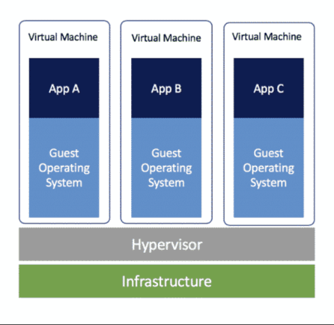
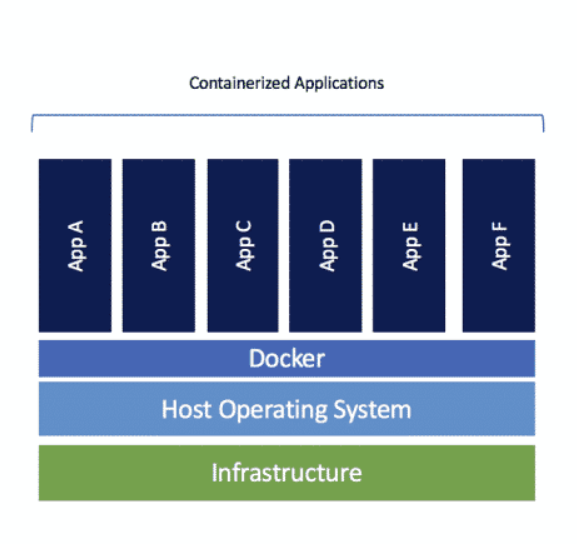

# Containers Versus Virtual Machines

## Both Try To Solve

## Virtual Machines (VMs)

## Containers

## This isn't a session to show whether VMs or containers are better

## Our CloudOps infrastructure depends on both VMs and Containers

- We have clusters of VM that serve as host for the containers
- These clusters are in AWS and are called Elastic Kubernetes Service (EKS). More on this next week.
- Because we use EKS all applications must be containerized.

## Compare and Contrast

- Both allow encapsulating the runtime environment for applications
- Both can be 'packaged' and shared (ex: .ova file versus image)
- Both require a virtualization layer
- Both require a host to run on (containers can run on a VM)

***

- Virtual machines emulate the host's hardware
- Containers utilize the actual host's hardware
- Benefit: containers can take advantage of actual host GPUs

***

- Virtual machines require a full OS installation
- Containers use the host's kernel and only need the essential dependencies for the application
- Benefit: easier creation, space saving

***

- Virtual machines usually require more resources (RAM, CPU)
- Containers usually require less
- Benefit: possible to run multiple instances of different versions

***

- Virtual machines: when corrupted, they may require rebuilding, which takes time.
- Containers: when corrupted, they can be destroyed and immediately recreated.
- Benefit: possibly quicker recovery

***

- Virtual machines have a 'desktop`
- Containers: are console/command line only
- Benefit: VMs are able to run applications that require a desktop GUI

## The CloudOps Infrastructure is fully in the cloud

- Therefore, we take advantage of the speed at which containers can be created, managed, and destroyed.
- Today, we'll begin our discussion with Docker.